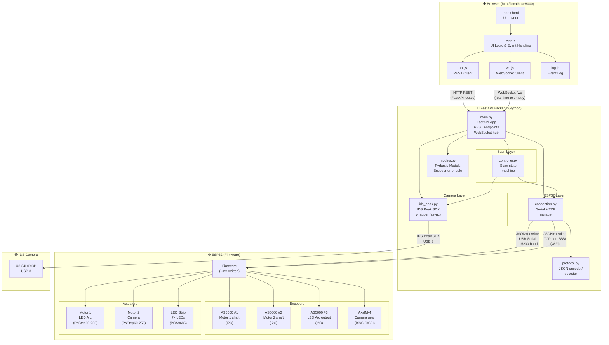

# GRControl

Browser-based control software for a tabletop **Gonioreflectometer** — a precision optical measurement device that captures images of a sample surface under controlled illumination and viewing angles.

---

## Hardware Overview

The device is housed in a 40×40×36 cm aluminium profile enclosure and contains:

| Component | Details |
|---|---|
| **LED Arc** | 7-LED strip mounted on a motorised curved arc |
| **Camera** | IDS U3-34L0XCP Rev.1.2 with DS-10M11-C3514 35 mm lens |
| **Motor 1** (LED Arc) | Nema17 stepper + PoStep60-256 driver |
| **Motor 2** (Camera) | Nema17 stepper + PoStep60-256 driver |
| **LED Driver** | PCA9685 PWM controller |
| **Controller** | ESP32 |
| **Encoder 1** | AS5600 on Motor 1 shaft (I2C) |
| **Encoder 2** | AS5600 on Motor 2 shaft (I2C) |
| **Encoder 3** | AS5600 on LED arc output shaft (I2C) |
| **Encoder 4** | AksIM-4 18-bit off-axis ring encoder on camera gear (BiSS-C over SPI) |

Both the LED arc and camera mount are driven by geared timing belt systems sharing the same rotational axis. The dual-encoder setup (one on the motor shaft, one on the final output) allows the software to measure and display mechanical error at each position.

---

## Software Architecture

```
GRControlSoftware/
├── backend/                  # Python / FastAPI
│   ├── main.py               # FastAPI app, REST API, WebSocket hub
│   ├── models.py             # Data models, encoder error calculation
│   ├── esp32/
│   │   ├── connection.py     # Serial (USB) + TCP (WiFi) connection manager
│   │   └── protocol.py       # JSON message encoder/decoder
│   ├── camera/
│   │   └── ids_peak.py       # IDS Peak SDK wrapper (async)
│   └── scan/
│       └── controller.py     # Scan sequence state machine
├── frontend/                 # Vanilla JS + HTML/CSS (no build step)
│   ├── index.html
│   ├── css/style.css
│   └── js/
│       ├── app.js            # Main UI logic
│       ├── api.js            # REST client
│       ├── ws.js             # WebSocket client (auto-reconnect)
│       └── log.js            # In-browser event log
├── docs/
│   └── esp32_protocol.md     # Full communication protocol spec for ESP32 firmware
├── requirements.txt
└── run.py                    # Server startup script
```

**Stack:** Python 3.9+, FastAPI, uvicorn, pyserial, IDS Peak SDK, Vanilla JS — no frontend build toolchain required.

---

## Software Architecture



---

## Requirements

- Python 3.9 or newer
- [IDS Peak SDK](https://en.ids-imaging.com/ids-peak.html) installed on the PC (for camera support)
- IDS U3-34L0XCP camera connected via USB 3
- ESP32 connected via USB or on the same WiFi network

---

## Installation

```bash
# 1. Clone the repository
git clone https://github.com/TouseefQ/GRControl.git
cd GRControl

# 2. Create and activate a virtual environment
python -m venv .venv

# macOS / Linux
source .venv/bin/activate

# Windows
.venv\Scripts\activate

# 3. Install dependencies
pip install -r requirements.txt

# 4. Start the server
python run.py
```

Then open **http://localhost:8000** in your browser.

### Windows notes

The instructions above work on Windows without any changes. A couple of things to be aware of:

- **Serial port names** — on Windows, ports are listed as `COM3`, `COM4`, etc. instead of `/dev/cu.*`. Use the **Refresh ports** button in the Connection panel to list them.
- **IDS Peak SDK** — download and install the Windows version from the [IDS website](https://en.ids-imaging.com/ids-peak.html) before running the software. The camera will not open without it, but the rest of the software (motor control, scan config, UI) works fine without it.
- **Firewall** — if using WiFi/TCP mode, allow Python through the Windows Firewall when prompted on first launch.

---

## User Guide

### 1. Connecting to the ESP32

The software supports two connection modes. Use whichever matches your setup.

**Serial (USB)**
1. Plug the ESP32 into the PC via USB.
2. In the **Connection** sidebar, select the **Serial** tab.
3. Click **Refresh ports** and select the correct COM port.
4. Click **Connect**.

**WiFi (TCP)**
1. Ensure the ESP32 is connected to the same network as the PC.
2. Select the **WiFi / TCP** tab.
3. Enter the ESP32's IP address.
4. Click **Connect**.

The LED icon next to "Disconnected" turns **green** when the connection is established.

---

### 2. Setting the Home / Zero Reference

The device has no physical limit switches. Home is set by encoder reference.

1. Manually rotate both mounts to the desired zero position.
2. In the **Reference / Home** sidebar, click **Set Home (Both)** — or set them individually with **Home LED** / **Home Camera**.
3. All subsequent angle readings and movements are relative to this reference.

---

### 3. Opening the Camera

1. In the **Camera Control** card, click **Open Camera**.
2. The LED icon next to "Camera off" turns **green** when the camera is ready.
3. Adjust **Exposure (µs)** and **Gain** as needed, then click **Apply Settings**.
4. Select your preferred **Image Format** (TIFF / PNG / JPEG / BMP).
5. Set the **Output Folder** path where captured images will be saved.
6. Click **↻ Refresh** to grab a live preview frame.

---

### 4. Manual Motor Control

Located in the **Manual Motor Control** card (at the bottom of the main panel).

**Jog** — move by a fixed number of microsteps:
1. Enter the number of steps in the **Jog — steps** field.
2. Set the **Jog speed** with the slider.
3. Click **◀ CCW** or **CW ▶** to jog in the desired direction.

**Move to absolute angle** — move to a precise angle:
1. Enter the target angle (0–360°) in the input field.
2. Set the **Move speed** with the slider.
3. Click **Go**.

Click **⬛ Stop Motor 1/2** to halt a motor immediately. The **⬛ E-STOP** button in the top bar stops both motors and turns off all LEDs instantly.

---

### 5. Manual LED Control

Located in the **LED Control** card (last section).

- Click an **L1–L7** button to toggle that LED on/off.
- The small slider beneath each LED button controls its **brightness** (0–255 PWM).
- **All On** / **All Off** buttons control all LEDs at once.

---

### 6. Running a Scan

Configure a scan in the **Scan Configuration** card.

**Per-axis settings (LED Arc and Camera independently):**

| Field | Description |
|---|---|
| Start (°) | Starting angle for this axis |
| Stop (°) | Ending angle for this axis |
| Step (°) | Angular increment between positions |
| Speed (%) | Motor speed as a percentage of maximum |

**LEDs Active During Scan:** Check/uncheck individual LEDs (L1–L7) to select which ones fire at each scan position.

**Move both motors simultaneously:** When checked, both motors move to the next position at the same time. When unchecked, LED arc moves first, then camera.

The **Estimated positions** and **Total captures** counters update live as you adjust the parameters.

Once configured, click **▶ Start Scan**. The software will:

1. Move both motors to the first (LED angle, camera angle) position.
2. For each enabled LED — turn it on, capture an image, turn it off.
3. Move to the next position and repeat.
4. Display a progress bar and live position readout while running.

Use **⏸ Pause** to hold the scan at the current position and **▶ Resume** to continue. **⬛ Abort** stops the scan immediately and turns off all LEDs.

---

### 7. Encoder Error Monitoring

The **Encoder Readings** card at the top of the main panel shows all four encoder values in real time:

| Display | Encoder | Location |
|---|---|---|
| Motor 1 — LED Arc | AS5600 | Motor 1 shaft |
| LED Arc Final | AS5600 | LED arc output shaft |
| Motor 2 — Camera | AS5600 | Motor 2 shaft |
| Camera Final | AksIM-4 | Camera gear (final output) |

The **LED Arc Error** and **Camera Error** values show the difference between each motor shaft reading and its corresponding final output encoder. This reveals any mechanical slack or belt slippage in the drivetrain:

- **Green** — error < 0.5°
- **Yellow** — error 0.5° – 2.0°
- **Red** — error > 2.0°

---

### 8. Captured Images

Each captured image is saved to the configured output folder with a filename encoding the scan position:

```
LED_045.000deg_CAM_030.000deg_LED02_20260614_142301_123456.tiff
```

A JSON sidecar file (same name, `.json` extension) is saved alongside every image containing full metadata:

```json
{
  "timestamp": "2026-06-14T14:23:01.123456",
  "led_target_deg": 45.0,
  "camera_target_deg": 30.0,
  "led_index": 2,
  "led_brightness": 200,
  "encoder_motor1_deg": 45.0021,
  "encoder_motor2_deg": 29.9987,
  "encoder_led_arc_deg": 45.4512,
  "encoder_camera_deg": 30.0103,
  "encoder_led_error_deg": 0.4491,
  "encoder_camera_error_deg": 0.0116
}
```

Captured images appear as thumbnails in the **Captured Images** gallery. Click any thumbnail to open a full-size lightbox view.

---

## ESP32 Firmware

The communication protocol is fully documented in [docs/esp32_protocol.md](docs/esp32_protocol.md). It covers:

- Message format (JSON-newline over Serial or TCP)
- All PC → ESP32 commands (MOVE, JOG, STOP, LED\_SET, SET\_HOME, etc.)
- All ESP32 → PC messages (STATE telemetry, ACK, MOVE\_DONE, ERROR)
- AS5600 I2C read procedure
- AksIM-4 BiSS-C SPI decode procedure with example Arduino sketch
- Watchdog and error handling rules

---

## Theme

Click the **🌙 / ☀️** button in the top-right corner to toggle between dark and light themes. The preference is saved in the browser's local storage.
